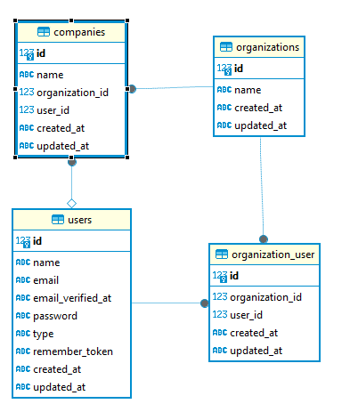

# Simple test database

With laravel 11 and Filament 3.x

## Install and Run

clone into a folder and cd into it

composer update

npm install

npm run build

php artisan key:generate --ansi

php artisan migrate --graceful --ansi
php artisan migrate:fresh --seed

php artisan serve

open web page http://127.0.0.1:8000/admin ~or whatever the server says + admin

user: admin@ex.io

password: asdf

## Add your notes here

Test started by Boris Soto - 02/16/2025 19:30 GMT-4 (Bolivia)

### Outline

## Project Overview

This project involves managing Users, Organizations, and Companies with specific restrictions. The key relationships are as follows:

-   **Users**: Can have types (Admin, Staff, Client).

-   **Organizations**: Can have many Staff users (but no duplicates). Can have many companies

-   **Companies**: Can have one Client user, and a Company is linked to one Organization.

## Getting Started

To set up the database and populate it with seed data:

### To seed the existing data:

```bash

php  artisan  db:seed

```

### To reset the database and re-seed data:

```bash

php  artisan  migrate:fresh  --seed

```

#### Organization-User Relationship:

The organization_user pivot table handles many-to-many relationships for users of type staff. Each Organization can have many Staff users, and each Staff user can belong to multiple organizations.

#### Company-User Relationship:

A Company can have many Client users, but only one client is assigned to a company. A User with type Client is associated with one company only, with a unique user_id for each company.

### Database Schema

Tables

##### Users:

Fields: name, email, type (enum: Admin, Staff, Client)

Relationships:

Many-to-many with Organization through organization_user

One-to-one with Company (for Client type users)

#### Organizations:

Fields: name

Relationships:

Many-to-many with Staff (through organization_user)

One-to-many with Company

#### Companies:

Fields: name, organization_id, user_id (client type user)

Relationships:

One-to-one with Organization

One-to-one with User of type Client

### Migrations

The migrations for the tables are:

Users table: Add a type field with values: Admin, Staff, Client.

Organizations table: name

Companies table: name, organization_id (foreign key), and user_id (client user).

Organization_User table: organization_id, user_id

### Seeders

UserSeeder: Creates 1 Admin, 20 Staff, and 200 Client users.

OrganizationSeeder: Creates 5 Organizations.

CompanySeeder: Creates 30 Companies.

OrganizationUserSeeder: Assigns random amount of Staff users to 5 organizations

## Usage

#### User Creation:

When creating a User you can assign the type of user (admin, staff, client)

#### Company Creation:

When creating a Company, you can assign one Client user from the 170 available Client users, because 30 are already assigned

#### Organization Creation:

Organizations can have multiple Staff users, but there will be no duplicates. A Staff user can belong to many Organizations.

### Project Diagram



### Other Notes / Questions/ Comments
